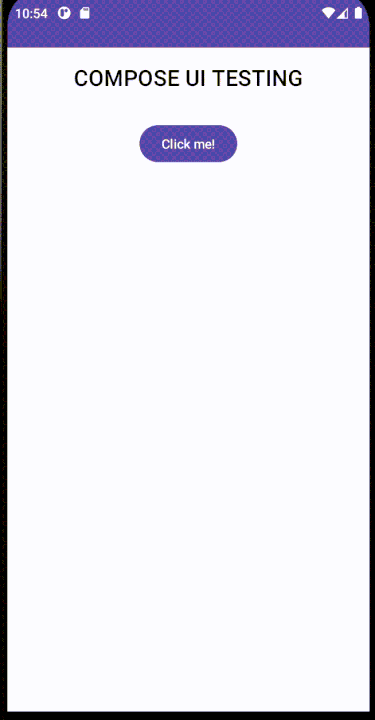

# Jetpack Compose UI Testing 

How to write a ui test for a screen with one button and one text.

## Screen Gif 

    

## Click the link for more
[Medium Article Link](https://medium.com/@talhafaki/jetpack-compose-ui-test-i-90907eb0aab5)

